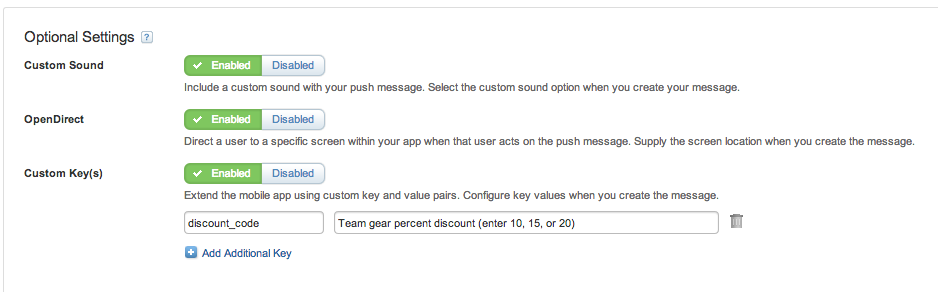

# SDK Explorer

SDK Explorer is a sample app that demonstrates the features available for use in the Salesforce Marketing Cloud [JB4A-SDK](https://github.com/ExactTarget/JB4A-SDK-iOS). See the [Implemented SDK Features](#implemented) section below for a full list of the features that are implemented.

### About the JB4A SDK

The JB4A SDK allows you to utilize MobilePush functionality as part of your iOS mobile app. This functionality includes the ability to send push messages to mobile devices through the app (based on demographic information or geofence triggers), collect analytics information based on the results of sent push messages, and many other things. For a high level overview of MobilePush features see [here](http://www.exacttarget.com/products/mobile-marketing/drive-mobile-app-engagement). For technical discussion on MobilePush see [here](https://code.exacttarget.com/journey-builder-for-apps/).

### The Important Bits

To quickly view all SDK implementation code blocks, search the entire project for ET_NOTE and browse the results. All code directly related to the SDK has been commented with this in order to make it easy to understand what is and what isn't related to SDK implementation. Additionally the following files are good starting places to view SDK implementation:

- [PUDAppDelegate.m](PublicDemo/PUDAppDelegate.m) Demonstrates SDK initialization & setup, location setup, device registration, OpenDirect setup, badge count reset, device token handling, push notification handling, and custom key handling
- [PUDPreferencesTableViewController.m](PublicDemo/PUDPreferencesTableViewController.m) Demonstrates adding attributes and tags

###  Implemented SDK Features

The following SDK features are implemented by the app:

- [Tags](https://code.exacttarget.com/apis-sdks/journey-builder-for-apps/feature-implementation/tags.html)
- [Attributes](https://code.exacttarget.com/apis-sdks/journey-builder-for-apps/feature-implementation/attributes.html)
- [Push Messages](https://code.exacttarget.com/api/messagecontact-send-0) (via Fuel REST Route)
- [Custom Alert Sound](https://code.exacttarget.com/apis-sdks/journey-builder-for-apps/feature-implementation/custom-sound.html)
- [OpenDirect](https://code.exacttarget.com/apis-sdks/journey-builder-for-apps/feature-implementation/open-direct.html)
- [Custom Key](https://code.exacttarget.com/apis-sdks/journey-builder-for-apps/feature-implementation/custom-keys.html)
- [Location Messages](https://code.exacttarget.com/apis-sdks/journey-builder-for-apps/location-services/geolocation.html)
- [CloudPages](PublicDemo/PUDMessageComposeTableViewController.m)
- [CloudPage Inbox](PublicDemo/PUDCloudPageInboxViewController.m)

In addition the app:

- Displays the raw payload of the most recently received push message
- Displays device info including: device token, device id, app id, access token
- Lets you quickly and easily [email debug information](#debug) directly to Salesforce

###  Sending Debug Data To Salesforce

This app allows you to easily send debug information to Salesforce directly from your device. To do this follow these steps:

1. Navigate to the Info tab
2. Tap the action button in the top right
3. Tap the send button to email debug information to Salesforce. You can optionally send the information to yourself using the standard email fields (to, cc, bcc)
4. Done!

### Setting Up The App In Your Account

1. Follow the steps in [Integrate MobilePush into your mobile app using the Journey Builder for Apps SDK](https://code.exacttarget.com/apis-sdks/journey-builder-for-apps/getting-started.html) up until the "How to Implement Analytics in your iOS Mobile App" section. At this point you will have the app set up in your AppCenter account, have the app provisioned, and have an AppID and AccessToken corresponding to your app.
2. Place the access token and application id you received within AppCenter into [PUDAppSettingConstants.m](PublicDemo/PUDAppSettingConstants.m) file. PUDAppSettingConstants is where you will place app specific settings such as access token, clientid, client secret, and more.
3. *NOTE: At this point you will be able to send messages to the app from MobilePush inside the Salesforce Marketing Cloud. You can also set attributes within the app's Settings tab. You only need to continue further if you wish to be able to create and send push messages from within the app.*

4. Under the Administration panel in MobilePush, enable all of the optional settings (custom sound, OpenDirect, and Custom Keys) then create a custom key in your account and name it "discount_code": 
5. Create an outbound message inside MobilePush. Be sure to select "API Trigger" as the Send Method. Set the settings so that they match the following screenshot: 
6. Place the message id of the message you just created into the [PUDAppSettingConstants.m](PublicDemo/PUDAppSettingConstants.m) file.
7. Place your Fuel clientId and clientSecret into the [PUDAppSettingConstants.m](PublicDemo/PUDAppSettingConstants.m) file (you were given these when you set up server to server communication inside AppCenter).
8. Start sending pushes from inside the app!

### Third Party Libraries Used

The following libraries aren't required in order to use the JB4A SDK. They are used by this sample app for purposes unrelated to SDK functionality.

- [AFNetworking 2.0](https://github.com/AFNetworking/AFNetworking)
- [JDStatusBarNotification](https://github.com/jaydee3/JDStatusBarNotification)
- [PBWebViewController](https://github.com/kmikael/PBWebViewController)